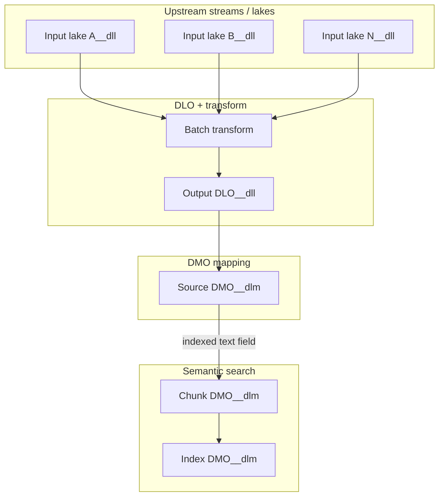

# Transform output → DMO → vector search: data cascade (not deploy cascade)

Generic pattern for kits where **semantic search** (`DataSemanticSearch`) indexes a **source DMO** populated by a **batch transform** over **upstream lake objects** (often CRM streams).

This document describes the **generic pattern only**. Product-specific object names, dependency diagrams, and install runbooks belong in your package's own documentation — not in this skill.

---

## Hypothesis

> **Once the last blocking upstream lake has rows, downstream data can populate in cascade — but operators must manually full-run the transform and redeploy/retry semantic search. Metadata deploy of DLO + transform does not require lake data; search may fail or be useless until the source DMO has rows.**

**Do not assume:** A lake filling automatically deploys later kit steps or re-runs transforms.

| Layer | Needs deploy? | Needs data / manual run? |
|-------|---------------|---------------------------|
| Upstream streams (CRM, file, etc.) | Yes | Yes — lake rows via stream sync |
| Output DLO | Yes | No for deploy |
| Batch transform | Yes | **Yes — Full Run** after upstream lakes ready |
| Source DMO | Packaged / mapped | Yes — from DLO after transform runs |
| Vector search index | Yes (separate step) | **Likely yes** — source DMO needs rows on indexed field(s); **Agentforce often required** for deploy/index build |

---

## Generic dependency pattern

Typical publishing sequence tail:

```
… → upstream streams → output DLO → batch transform → semantic search index
```



**INNER joins** in the transform graph: one empty input lake ⇒ transform **SUCCESS with 0 output rows**.

---

## Manual cascade checklist

Use when DLO + transform are **already deployed** but output DLO / source DMO / search are empty.

1. **Identify blocking lake** — query each transform input `*__dll` (lake SOQL is authoritative; stream counters can lag).
2. **Sync blocking stream** — CRM UPSERT streams often require **UI refresh** (REST run may be blocked for `SalesforceDotCom`).
3. **Full Run transform** (UI — API re-run may return **`SKIPPED_NO_CHANGES`** after an early empty run).
4. **Verify output DLO** — query output `*__dll` for expected rows and indexed field(s).
5. **Verify source DMO** — UI preview; `*__dlm` SOQL may be unsupported (managed subscriber: query `Namespace__SourceDmo__dlm`).
6. **Enable Agentforce** — often required before vector search deploy / index build; embedding + semantic search services depend on it.
7. **Retry semantic search deploy** — Connect REST `DataSemanticSearch`; separate step, not triggered by data. `DataKitDeploymentLog` may show Failed even when the runtime index is created — verify via `DataSemanticSearch` and Connect `GET /ssot/search-index/{developerName}`.

---

## Common misconceptions

| Misconception | Reality |
|---------------|---------|
| “Downstream isn’t deployable without data” | DLO + transform **deploy** without lake rows |
| “Fixing upstream lake auto-deploys search” | Search index is a **separate deploy** |
| “Transform SUCCESS means output has data” | Can be SUCCESS with **0 rows** if run too early |
| “API re-run after lakes fill is enough” | Often **`SKIPPED_NO_CHANGES`** — use UI **Full Run** |
| “Stream record count = lake ready” | Query `*__dll` |

---

## Related docs

- Post-install workflow: [post-install-deploy-runbook.md](post-install-deploy-runbook.md)
- Semantic search deploy payload: [deploy-components-flow.md](deploy-components-flow.md)
